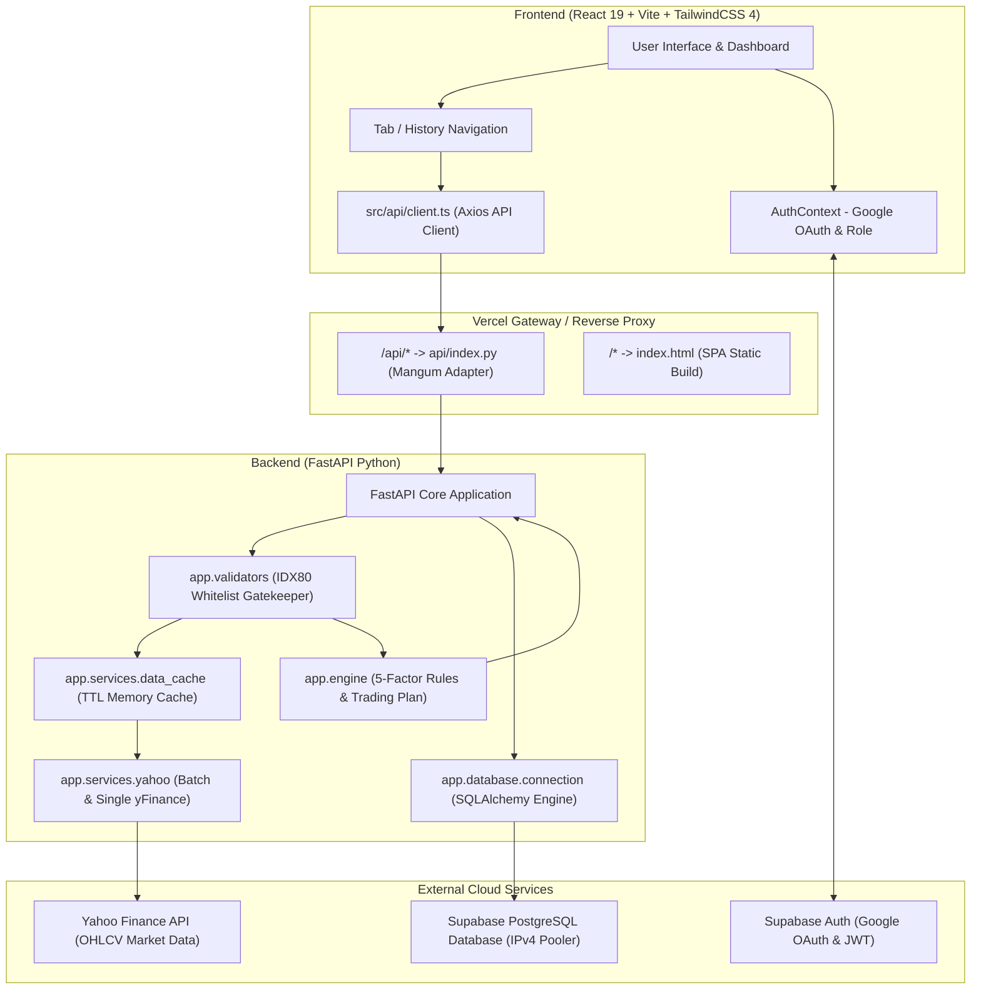
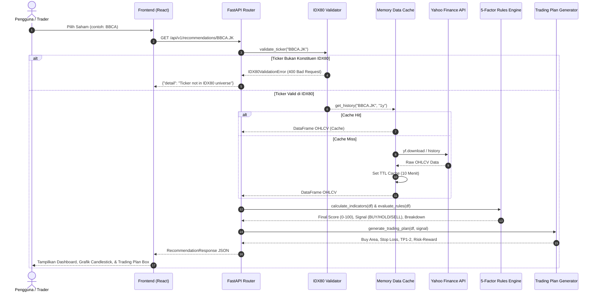

# Arsitektur Sistem — IHSG Smart Stock Recommendation (IDX80)

Dokumen ini menjelaskan gambaran arsitektur sistem, hubungan antara frontend dan backend, alur data end-to-end, struktur modular, serta kebijakan keamanan aplikasi **Sistem Rekomendasi IHSG (IDX80)**.

---

## 1. Gambaran Arsitektur Tingkat Tinggi (High-Level Architecture)

Aplikasi dirancang dengan arsitektur **Single-Repository Fullstack**, dapat dijalankan di lingkungan lokal (Uvicorn + Vite dev server) maupun dideploy secara serverless di platform cloud seperti **Vercel** atau **Render/Railway**.

---

## 2. Hubungan Frontend dan Backend

| Aspek | Frontend (`src/`) | Backend (`backend/app/`) |
| :--- | :--- | :--- |
| **Teknologi** | React 19, TypeScript, Vite, TailwindCSS 4 | Python 3.12+, FastAPI, Mangum, SQLAlchemy 2.0 |
| **Komunikasi** | REST API via Axios (`src/api/client.ts`) | Endpoint `/api/*` dan `/api/v1/*` |
| **Autentikasi** | `@supabase/supabase-js` SDK & Bearer JWT | JWT verification, RBAC via `app.middleware` |
| **State Management** | React Hooks, Context API (`AuthContext`) | In-memory TTL Cache (`idx80_cache`), DB Session |
| **Target Deployment** | Static SPA (`dist/index.html`) | Python Serverless Function (`api/index.py`) atau Uvicorn container (`Procfile`) |

---

## 3. Alur Data End-to-End (Data Flow Pipeline)

Setiap permintaan analisis atau screening saham melewati alur sistematis sebagai berikut:

---

## 4. Struktur Modul & Tanggung Jawab (Module Responsibilities)

### A. Frontend (`src/`)
- **`src/api/`**: Berisi `client.ts` yang menjadi titik pusat pemanggilan seluruh endpoint API backend (Stocks, Recommendations, Screener, Auth, Admin, Reports) dengan interceptor JWT token otomatis.
- **`src/components/common/`**: Komponen independen yang digunakan lintas halaman (`AuthModal` untuk otentikasi Google/Email, `ProtectedRoute` untuk pembatasan akses hak role admin).
- **`src/components/layout/`**: Komponen struktur dan navigasi responsif (`Navbar` untuk desktop/tablet, `BottomNav` untuk mobile).
- **`src/components/chart/`**: Visualisasi grafik interaktif (`CandlestickChart` berbasis Recharts, `StockChart`).
- **`src/components/dashboard/`**: Widget visual ringkasan pergerakan IHSG dan quick cards emiten.
- **`src/components/recommendation/`**: Tampilan visual kartu sinyal DSS (`RecommendationCard`), `TradingPlanCard`, dan kalkulator rasio risiko (`TradingPlanBox`).
- **`src/components/screener/`**: Tabel data interaktif hasil screening IDX80 (`ScreenerTable`) dengan pagination, sorting, dan filter multivariat.
- **`src/constants/`**: Nilai konstan aplikasi (konfigurasi nama, timeframe, label sinyal).
- **`src/context/`**: State manajemen sesi pengguna, peran (`user`/`admin`), dan integrasi Supabase OAuth (`AuthContext`).
- **`src/pages/`**: Halaman tingkat rute (`DashboardPage`, `ScreenerPage`, `AnalysisPage`, `AdminPage`, `ReportsPage`).
- **`src/types/`**: Definisi tipe TypeScript untuk response API, indikator, dan profil.
- **`src/utils/`**: Helper murni untuk pemformatan mata uang Rupiah, angka, dan penentuan warna badge sinyal.

### B. Backend (`backend/app/`)
- **`app/api/v1/`**: Controller/handler rute REST API yang terorganisir per domain fungsional:
  - `stocks.py`: Info profil emiten, pencarian emiten IDX80, dan histori harga.
  - `recommendations.py`: Rekomendasi teknikal DSS & trading plan emiten.
  - `screening.py`: Pemicu quick scan dan batch scanner konstituen IDX80.
  - `auth.py`: Sinkronisasi profil login Google OAuth dan verifikasi password.
  - `admin.py`: Manajemen pengguna dan log audit untuk role Admin.
  - `reports.py`: Publikasi dan pencarian analisis riset saham oleh pengguna.
- **`app/config/`**: Konfigurasi aplikasi (`settings.py`) dan master data konstituen 80 saham terlikuid BEI (`idx80_tickers.py`).
- **`app/core/`**: Komponen fundamental keamanan, hashing, dan validasi IDX80 (`security.py`, `idx80_validator.py`, `config.py`).
- **`app/database/`**: Pengelolaan koneksi database Supabase via HTTPS REST client dan direct PostgreSQL pooler via SQLAlchemy (`connection.py`).
- **`app/engine/`**: Mesin kalkulasi kuantitatif teknikal (`indicators.py`), sistem inferensi keputusan 5 faktor (`rules.py`), dan automated trading plan (`trading_plan.py`).
- **`app/screener/`**: Strategi screener spesifik (`trend.py`, `momentum.py`, `breakout.py`, `oversold.py`, `trading_setup.py`) dan multi-threaded batch scanner (`batch_scanner_engine.py`).
- **`app/services/`**: Layanan integrasi eksternal (Yahoo Finance batch downloader `yahoo.py`, caching in-memory `data_cache.py`, pengiriman email SMTP `email_sender.py`).
- **`app/universe/`**: Pengelola konstituen IDX80 dan sinkronisasi berkala ke database (`stock_universe_manager.py`, `scheduler.py`).
- **`app/models/`**: Definisi skema tabel ORM SQLAlchemy (`stock_model.py`).
- **`app/schemas/`**: Skema validasi data request & response Pydantic (`stock.py`, `recommendation.py`).
- **`app/middleware/`**: Helper dependency injeksi otentikasi role-based access control.
- **`app/validators/`**: Wrapper fungsi validasi simbol saham whitelist IDX80.

---

## 5. Model Data & Skema Database

Tabel utama di PostgreSQL (Supabase):
1. **`stocks`**: Master profil emiten (simbol, nama perusahaan, sektor, exchange).
2. **`stock_prices`**: Data historis OHLCV harian saham.
3. **`indicators`**: Nilai teknikal harian terhitung (MA20, MA50, MA200, RSI, Volatilitas).
4. **`screener_results`**: Skor evaluasi 5 faktor dan sinyal rekomendasi per emiten.
5. **`trading_plans`**: Rencana level beli, cut loss, dan target profit.
6. **`idx80_stocks`**: Whitelist konstituen IDX80 resmi aktif.
7. **`profiles`**: Profil pengguna terdaftar Google OAuth beserta role (`user`/`admin`).
8. **`reports`**: Laporan riset dan analisa yang dibuat oleh pengguna/analis.
9. **`activity_logs`**: Rekaman jejak audit aktivitas pengguna untuk pengawasan admin.

---

## 6. Model Keamanan & Otorisasi

1. **Role-Based Access Control (RBAC)**:
   - `ADMIN`: Akses penuh ke seluruh data, audit trail, pengelolaan role pengguna, dan penghapusan laporan publik.
   - `USER`: Dapat melihat analisis, menjalankan screener, membuat/mengedit laporan milik sendiri.
   - `GUEST`: Akses read-only ke dashboard publik, ringkasan pasar, dan rekomendasi dasar.
2. **Pencegahan Penyalahgunaan API**:
   - Validasi ketat pada setiap request ticker saham melalui `idx80_validator.py`. Permintaan ticker di luar whitelist IDX80 langsung ditolak sebelum mencapai Yahoo Finance API guna menghemat kuota dan memitigasi *rate limiting*.
3. **Resiliensi Database**:
   - Dual-path connection: Mengutamakan HTTPS Supabase Client dan SQLAlchemy IPv4 Connection Pooler (`aws-0-ap-northeast-1.pooler.supabase.com`), dengan fallback anggun jika jaringan direct database mengalami kendala sementara.
